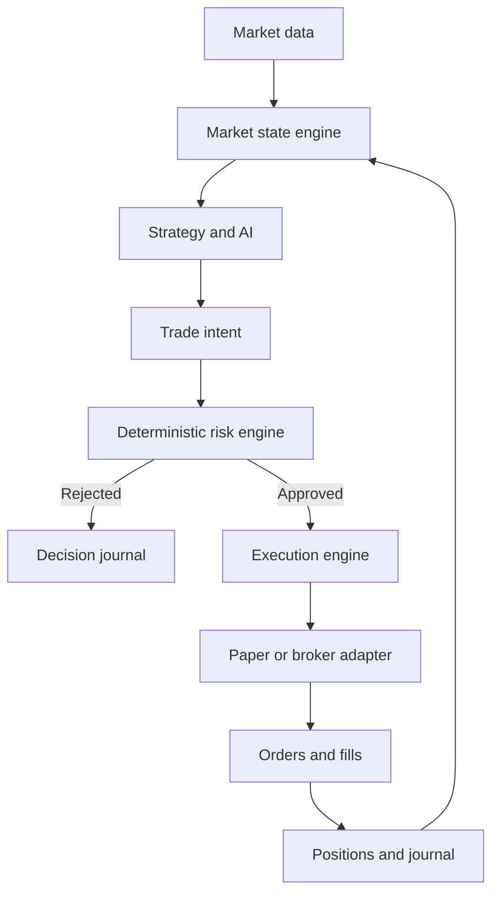

# xTrader — Master Build Prompt

**Purpose:** Give this entire document to the coding agent that will build xTrader. It contains the product vision, architecture, safeguards, roadmap, and the exact first assignment.

| Item | Decision |
| --- | --- |
| Product name | **xTrader** — preserve this capitalization everywhere in the UI and documentation |
| Repository / package name | `xtrader` |
| Initial stage | Personal-use POC, built incrementally toward an MVP |
| First broker | Zerodha Kite Connect |
| Future brokers | Groww, Upstox, Angel One, Interactive Brokers |
| Backend | Node.js + TypeScript |
| Frontend | Next.js + TypeScript |
| Database | PostgreSQL |
| Initial execution | Paper only; live trading disabled |
| First assignment | Phase 1: secure Zerodha connection and account dashboard |

You are the lead engineer implementing xTrader. Treat the decisions below as the project brief. This is a trading system: broker state, deterministic risk, execution correctness, reconciliation, and auditability are foundational. AI will operate above those components.

The overall POC target is **Zerodha login → secure session → account data → live market data → paper trades**. Implement only Phase 1 first. Later phases describe the destination, not permission to build everything immediately.

Examples of prices, capital, risk limits, and scores in this document are illustrative configuration and test data. They are not current market quotes, trading recommendations, or claims of profitability.

## 1. Product vision

Build an AI-assisted trading platform that can eventually operate autonomously within deterministic limits.

The long-term product goes beyond a single indicator rule such as `RSI < 30 → BUY`. It should combine market context, deterministic calculations, strategy evaluation, structured AI reasoning, and trading history.

The eventual agent should be able to:

- Continuously observe selected instruments during market sessions.
- Analyse price action, volume, volatility, indicators, and historical behaviour.
- Eventually incorporate news, events, and broader market context.
- Identify possible opportunities and explicitly choose `NO_TRADE` when appropriate.
- Construct a trade thesis with entry, stop, targets, horizon, and invalidation conditions.
- Submit a structured proposal to a deterministic risk engine.
- Execute only approved actions through the execution engine.
- Monitor positions, reassess the thesis, and request controlled exits.
- Journal decisions, orders, fills, and outcomes.
- Review completed trades and build persistent trading memory.

Example future user instruction:

> Allocate ₹1,00,000. Maximum daily loss: ₹1,000. Maximum risk per trade: ₹300. Monitor NIFTY and liquid large-cap stocks. No overnight positions. Avoid major RBI/Fed announcements. Trade only when there is a well-supported opportunity.

An instruction like this becomes validated configuration and an instrument scope. It must never become unrestricted broker access. Monitoring an index does not imply that the index itself is an orderable instrument.

## 2. Absolute architectural principle

**The AI must never have direct, unrestricted access to broker order APIs.**

Use this boundary:



The AI proposes intent. The risk engine decides whether it is permitted. The execution engine is the sole application component allowed to use broker order-write capabilities.

Frontend requests, manual paper orders, strategy decisions, and AI proposals must all pass through server-side validation and the appropriate risk path. A manual action is not a bypass.

## 3. First broker: Zerodha Kite Connect

Use this developer-app configuration:

| Field | Value |
| --- | --- |
| Type | `Connect` |
| App name | `xTrader` |
| Zerodha Client ID | The owner's actual Zerodha client ID; never invent it |
| App icon | Optional for the POC |
| Redirect URL | `http://127.0.0.1:3000/zerodha/callback` |
| Postback URL | Leave empty for the initial POC |
| Description | Personal AI-assisted trading application for market analysis, paper trading, risk management, and automated trade execution through Zerodha Kite Connect APIs. |

Zerodha documents local redirect URLs and an optional postback URL. Keep the registered redirect and application route identical, including the hostname, port, and path. Use `127.0.0.1` consistently during development. [Official app setup](https://support.zerodha.com/category/trading-and-markets/general-kite/kite-api/articles/how-do-i-sign-up-for-kite-connect).

Use the paid Connect plan for live and historical data. Zerodha currently lists ₹500/month per API key and does not provide a Kite Connect sandbox; xTrader therefore needs its own paper execution adapter. Prices and entitlements must be rechecked at setup time. [Official API FAQ](https://support.zerodha.com/category/trading-and-markets/general-kite/kite-api/articles/kite-connect-api-faqs).

Keep `KITE_API_KEY` and `KITE_API_SECRET` in backend configuration. Do not expose the secret, broker access token, or token-exchange response to frontend code, browser storage, logs, or Git.

Do not purchase subscriptions, create a developer app, or place a real order as part of implementing this prompt. The owner supplies the account configuration locally.

## 4. Technology stack and application shape

Use a modular monolith with a long-running Node backend:

| Layer | Initial choice |
| --- | --- |
| API and background runtime | Node.js, TypeScript strict mode; Express is sufficient |
| Web application | Next.js, TypeScript |
| Persistence | PostgreSQL with migrations |
| Validation | Runtime schemas for environment, requests, broker boundaries, and AI outputs |
| Commands and queries | REST |
| Browser updates | SSE or WebSocket when Phase 2 starts |
| Broker stream | Server-side Zerodha WebSocket |
| Package management | npm workspaces; keep setup straightforward |
| Redis | Optional later, only for a demonstrated requirement |

Keep the market stream and trading loop in the backend process, not in a React component or a short-lived serverless request handler.

Suggested development topology:

- Next.js: `http://127.0.0.1:3000`.
- Backend: `http://127.0.0.1:4000`.
- Proxy `/api/*` and `/zerodha/callback` through the Next.js origin to the backend, preserving query strings and session cookies.
- Use one browser origin so session handling and the registered callback remain simple.
- Start PostgreSQL with a small Docker Compose configuration, or support an existing local database.

Select compatible, maintained dependencies when implementing and commit a lockfile. Avoid unnecessary microservices, Kafka, Kubernetes, or a complex deployment platform in the POC.

## 5. Broker abstraction

Keep broker-specific identifiers, response formats, SDK calls, and error mappings inside adapters. Use capability interfaces so read-only modules do not receive order-write methods.

Illustrative contracts; define the referenced domain types as each phase needs them:

```ts
interface BrokerReadClient {
  getStatus(): Promise<BrokerConnectionStatus>;
  getProfile(): Promise<BrokerProfile>;
  getFunds(): Promise<Funds>;
  getPositions(): Promise<PositionSnapshot[]>;
  getHoldings(): Promise<Holding[]>;
}

interface BrokerMarketDataClient {
  getInstruments(): Promise<Instrument[]>;
  getQuotes(instruments: InstrumentRef[]): Promise<Quote[]>;
  connect(): Promise<void>;
  disconnect(): Promise<void>;
  subscribe(instruments: InstrumentRef[]): Promise<void>;
  unsubscribe(instruments: InstrumentRef[]): Promise<void>;
}

// Available only inside the execution module in a later phase.
interface BrokerOrderClient {
  getOrders(): Promise<BrokerOrder[]>;
  placeOrder(order: BrokerOrderRequest): Promise<OrderAcknowledgement>;
  modifyOrder(id: string, change: BrokerOrderChange): Promise<OrderAcknowledgement>;
  cancelOrder(id: string): Promise<OrderAcknowledgement>;
}

interface ExecutionAdapter {
  submit(trade: ApprovedTrade): Promise<ExecutionAcknowledgement>;
  cancel(action: ApprovedCancellation): Promise<ExecutionAcknowledgement>;
  reconcile(): Promise<ReconciliationResult>;
}
```

For Phase 1, implement `ZerodhaBroker` as a read client, plus a dedicated broker authentication/session service. Defer market-stream and order-write implementations to their phases.

Later implementations may include `GrowwBroker`, `UpstoxBroker`, `AngelOneBroker`, and `InteractiveBrokersBroker`. Do not create empty implementations for them now.

An exit is an execution workflow: determine the remaining position, pending orders, and permitted closing quantity. Do not assume every broker supplies a universal `exitPosition()` endpoint.

## 6. Operating modes

Preserve the product's paper, copilot, and autonomous experiences, but separate **where orders execute** from **who initiates them**.

```ts
type ExecutionMode = "PAPER" | "LIVE";
type AgentMode = "MANUAL" | "COPILOT" | "AUTONOMOUS";
```

| Experience | Execution mode | Agent mode | Behaviour |
| --- | --- | --- | --- |
| Manual paper trading | PAPER | MANUAL | User submits simulated trades through risk checks |
| Paper copilot | PAPER | COPILOT | Agent proposes; user approves; simulator executes |
| Paper autonomous evaluation | PAPER | AUTONOMOUS | Agent proposals execute in simulation after risk approval |
| Live copilot | LIVE | COPILOT | Later: explicit user approval plus fresh risk approval |
| Live autonomous | LIVE | AUTONOMOUS | Future only, behind separate enablement and validation gates |

Defaults:

```dotenv
EXECUTION_MODE=PAPER
AGENT_MODE=MANUAL
LIVE_TRADING_ENABLED=false
AUTONOMOUS_TRADING_ENABLED=false
```

Do not overload one variable with incompatible values such as `PAPER`, `COPILOT`, and `LIVE`. A broker connection may supply real account data and market data while execution remains paper-only.

Paper accounts, balances, orders, and positions must be separate from real broker account state. Never switch an existing order or position between modes.

## 7. Trade intent object

Strategy and AI outputs must use a schema-validated domain object. They do not contain executable broker instructions or trusted risk approval.

```json
{
  "decision": "TRADE",
  "instrument": {
    "exchange": "NSE",
    "symbol": "RELIANCE",
    "instrumentType": "EQUITY"
  },
  "direction": "LONG",
  "entryType": "LIMIT",
  "entryPrice": "2965.00",
  "stopLoss": "2940.00",
  "targets": ["3020.00"],
  "confidenceScore": 0.76,
  "timeHorizon": "INTRADAY",
  "strategy": "breakout-volume",
  "thesis": "Breakout above resistance with increasing volume",
  "invalidation": "Price closes below the breakout zone",
  "maxRiskRequested": "250.00",
  "metadata": {}
}
```

Use decimal strings at JSON boundaries and decimal arithmetic or integer minor units internally. Reject malformed values, non-finite numbers, invalid precision, and prices that violate instrument tick sizes.

The server adds the decision ID, account ID, execution mode, creation time, expiry, market snapshot ID, and strategy/model version. It resolves the instrument against authoritative instrument metadata and calculates the permitted quantity.

`confidenceScore` is a model/strategy score, not a verified probability of winning. Track calibration before making probability claims.

Future option intents additionally need underlying, strike, expiry, option type, lot size, and contract identity. Do not implement options now.

## 8. Deterministic risk engine

The risk engine must be pure or otherwise reproducible from explicit inputs, with no LLM dependence. AI cannot change its limits.

Support the following progressively:

- Allocated trading capital, available funds, and margin requirements.
- Maximum planned risk per trade and maximum daily loss.
- Daily profit lock, if configured with a clearly defined policy.
- Maximum open positions, trades per day, and consecutive losing trades.
- Per-symbol exposure, total exposure, and maximum capital allocation per trade.
- Mandatory stop, correct entry/stop/target direction, and minimum reward/risk.
- Allowed and blocked instruments, exchanges, products, and instrument classes.
- Equity-only mode, with futures and options disabled initially.
- Intraday-only policy, entry window, last-entry cutoff, and exit deadline.
- Data freshness, valid session, system readiness, and kill-switch state.

Example profile:

```json
{
  "capital": "100000.00",
  "maxDailyLoss": "1000.00",
  "maxRiskPerTrade": "300.00",
  "maxOpenPositions": 3,
  "maxTradesPerDay": 5,
  "minimumRiskReward": "1.5",
  "allowEquity": true,
  "allowFutures": false,
  "allowOptions": false,
  "allowOvernight": false
}
```

Calculate quantity from entry-to-stop distance, estimated costs/slippage, remaining risk budget, funds, exposure, and lot size. Round down and reject when no valid quantity remains. Planned stop risk is an estimate; market gaps and failed exits can produce larger actual losses.

Define daily net P&L as realised P&L plus marked open-position P&L minus fees. Define the daily-loss trigger explicitly; do not silently let profits enlarge the approved risk budget. Reserve incremental risk for pending entries and open positions without double counting loss already included in marked P&L.

Risk evaluation, budget reservation, and execution authorization must be atomic per account. Two simultaneous proposals must not each spend the same remaining budget. Approval expires and is bound to the exact intent, quantity, account, mode, risk-profile version, and market snapshot. Revalidate immediately before submission.

Example rejection:

```json
{
  "approved": false,
  "code": "MAX_RISK_PER_TRADE_EXCEEDED",
  "reason": "Requested planned risk of INR 420 exceeds the INR 300 limit."
}
```

Persist every approval and rejection. Implement baseline validation and risk limits before the first paper execution; Phase 4 expands this into the complete framework.

## 9. Kill switch

Implement a persistent, server-enforced global trading halt independent of the AI.

When activated:

- Block new entries and every action that increases exposure.
- Invalidate queued intents and unused approvals.
- Stop autonomous entry generation.
- Keep monitoring, reconciliation, and alerts running.
- Apply the user's chosen policy: maintain current positions, cancel pending entry orders, or attempt to flatten app-managed positions.

**Risk-reducing exits must remain available.** Do not implement a blanket `no orders allowed` condition that also disables protective exits.

Cancellation must distinguish entry orders from protective stops. Do not remove a protective stop and leave an open position unprotected. Flattening needs current broker state, bounded closing quantities, and reconciliation so racing fills do not reverse the position.

On restart, restore the halted state. Re-enabling requires an authenticated user action and a successful readiness check. Do not automatically liquidate unrelated holdings or manually opened positions.

## 10. Zerodha authentication and Phase 1 API

Use Kite's documented login flow. The owner signs in on Zerodha; the callback receives a short-lived `request_token`; the backend exchanges it using the app key and secret. Kite documents a SHA-256 checksum over `api_key + request_token + api_secret`. Its access token normally expires at 6 AM the following day and can be invalidated earlier; ordinary apps must not assume refresh-token access. [Official authentication documentation](https://kite.trade/docs/connect/v3/user/).

Application workflow:

1. An authenticated local owner starts `GET /api/brokers/zerodha/login`.
2. Store a short-lived, single-use login attempt linked to that application session.
3. Send a random correlation nonce using Kite's documented `redirect_params` mechanism.
4. Redirect the browser to Zerodha's login page.
5. Receive `/zerodha/callback` through the registered origin and forward it server-side.
6. Validate the session binding, nonce, expiry, and callback result; reject reuse and unsolicited callbacks.
7. Exchange the request token in the backend; validate the returned client ID against the allowed account.
8. Encrypt the access token and persist session metadata.
9. Redirect to a clean dashboard URL without the request token or other credentials.

Do not collect the user's Zerodha password or OTP in xTrader. Do not build automated login or a credential-based refresh workaround.

Initial API routes:

| Method | Path | Purpose |
| --- | --- | --- |
| GET | `/api/health` | Minimal liveness result with no secrets |
| GET | `/api/ready` | Database/configuration readiness; protected detail where appropriate |
| GET | `/api/brokers/zerodha/login` | Start a session-bound broker login |
| GET | `/zerodha/callback` | Validate callback and exchange token server-side |
| GET | `/api/brokers/zerodha/status` | Connection state and sanitized timestamps |
| POST | `/api/brokers/zerodha/disconnect` | Disable local access and attempt broker-session invalidation |
| GET | `/api/account/profile` | Normalized profile through the broker interface |
| GET | `/api/account/funds` | Normalized funds and margin data |
| GET | `/api/account/holdings` | Actual broker holdings |
| GET | `/api/account/positions` | Actual broker positions |

Authenticate account routes and protect mutations against CSRF. Broker connection and xTrader owner authentication are separate concerns. For a loopback-only POC, a minimal owner-session bootstrap is sufficient; explain it in the README. Do not expose account APIs anonymously on a network interface.

Return connection states such as `DISCONNECTED`, `CONNECTING`, `CONNECTED`, `EXPIRED`, and `ERROR`. Do not equate a token existing in the database with a healthy connection. Store the last successful validation time and require reauthentication when the broker rejects the session.

Token storage requirements:

- Use authenticated encryption, such as AES-256-GCM, with a new random nonce per encryption.
- Keep the encryption key outside PostgreSQL and separate from encrypted token records.
- Store ciphertext, nonce, authentication tag, key version, account link, and expiry metadata.
- Decrypt only within the backend credential/session service when required.
- Do not return ciphertext or plaintext token fields in API DTOs.
- Remove or invalidate local session material on disconnect. If remote invalidation fails, report that status honestly rather than claiming the broker session was revoked.

## 11. Market data engine

Use the broker WebSocket for continuous market data and order updates. Keep that connection on the backend, then send sanitized internal events to the browser. Kite provides streaming quote modes and order updates through its WebSocket API. [Official WebSocket documentation](https://kite.trade/docs/connect/v3/websocket/).

The processing stages are normalization, instrument state, candles, indicators, market state, and strategy evaluation.

```ts
interface Tick {
  instrumentId: string;
  brokerInstrumentToken: string;
  symbol: string;
  exchange: string;
  lastPrice: string;
  exchangeTimestamp?: string;
  lastTradeTimestamp?: string;
  receivedAt: string;
  cumulativeDayVolume?: string;
  buyQuantity?: string;
  sellQuantity?: string;
  ohlc?: {
    open: string;
    high: string;
    low: string;
    previousClose: string;
  };
  depth?: MarketDepth;
  source: "LIVE" | "REPLAY" | "DEMO";
}
```

Handle reconnects with bounded backoff and jitter, restore subscriptions, and detect gaps. A connected socket does not prove every subscribed instrument has fresh data.

Use instrument-specific metadata and suitable stream modes. Kite's LTP mode carries only price; richer modes expose additional fields, and index packets differ from tradable-instrument packets. Volume in a quote is cumulative for the day, so derive deltas instead of summing it for every update. [Stream modes and packet fields](https://kite.trade/docs/connect/v3/websocket/).

Cache and refresh the instrument master on a defined schedule. Resolve symbols to instruments; do not hardcode numeric broker tokens. Honor current broker quotas using separate endpoint rate limiters and bounded retry policies.

## 12. Candle engine

Initially support 1-minute, 5-minute, and 15-minute OHLCV candles. Later add 30-minute, hourly, and daily intervals.

Requirements:

- Store timestamps in UTC and apply `Asia/Kolkata` session boundaries for Indian markets.
- Align buckets to the exchange session, including holidays and special sessions.
- Distinguish open candles from closed candles.
- Use appropriate event timestamps and define handling of late, duplicate, and out-of-order updates.
- Derive volume from cumulative-volume changes and handle session resets explicitly.
- Flag partial history and feed gaps; do not fabricate a complete candle series.
- Warm indicators from historical candles where available, avoiding overlap with live aggregation.
- Make restart and replay behaviour deterministic, with unique candle keys.

If broker-derived historical candles differ from locally aggregated candles, retain provenance and a clear reconciliation policy.

## 13. Market state engine

AI consumes bounded, processed market context rather than raw tick streams.

```ts
interface MarketState {
  instrument: InstrumentRef;
  price: string;
  changePercent?: string;
  candles: CandleSummary[];
  trend: TrendState;
  momentum: MomentumState;
  volumeState: VolumeState;
  volatility: VolatilityState;
  supportLevels: string[];
  resistanceLevels: string[];
  indicators: IndicatorSnapshot;
  positionState: PositionSummary[];
  marketRegime: MarketRegime;
  snapshotId: string;
  lastUpdatedAt: string;
  source: "LIVE" | "REPLAY" | "DEMO";
  quality: DataQualityState;
}
```

Initial regime labels: `STRONG_BULLISH`, `BULLISH`, `RANGE`, `BEARISH`, `STRONG_BEARISH`, `HIGH_VOLATILITY`, and `UNKNOWN`.

Calculate indicators and numeric features deterministically. Document how labels are derived. Insufficient warm-up data or an uncertain regime should remain explicit, not default to a confident direction.

## 14. Initial indicators

Implement deterministic, individually testable modules for:

- EMA and SMA.
- RSI.
- ATR.
- Session VWAP.
- Volume averages.

Document lookback, initialization, smoothing convention, missing-data handling, and required warm-up. Validate results against known reference calculations. Do not ask an LLM to calculate indicators.

Future indicators and analytics: MACD, Bollinger Bands, ADX, Supertrend, relative volume, market breadth, open interest, and option-chain analytics.

## 15. Strategy engine

```ts
interface TradingStrategy {
  evaluate(
    marketState: MarketState,
    portfolioState: PortfolioState
  ): Promise<StrategyDecision>;
}

type StrategyDecision =
  | { decision: "TRADE"; intent: TradeIntent }
  | { decision: "NO_TRADE"; reasonCode: string; explanation: string };
```

`NO_TRADE` is a first-class, normal outcome. There is no target for trading frequency.

Start with transparent deterministic strategies such as an EMA trend filter, VWAP context, and a breakout with volume confirmation. Their purpose is to exercise the complete pipeline before adding AI.

Evaluate on defined events, such as a closed candle, with deduplication, cooldowns, and versioned configuration. Avoid repeatedly submitting the same setup on every tick.

## 16. AI engine

Introduce an AI-provider abstraction later:

```ts
interface AIProvider {
  analyseMarket(context: TradingContext): Promise<StrategyDecision>;
}
```

Potential implementations: OpenAI, Anthropic, Gemini, Ollama, and other local models. Begin with one provider only when Phase 6 starts.

Require structured JSON and validate it against a strict schema, followed by semantic and risk checks. Reject unknown instruments, invalid price relationships, unsupported actions, and malformed responses. Never translate arbitrary prose directly into orders.

Bound input size, inference frequency, latency, retries, and cost. On provider failure or expired context, record `NO_TRADE` or a typed failure and block new AI entries. Record model/provider, prompt version, input snapshot, validated output, and latency without storing secrets.

## 17. AI responsibilities and permissions

| AI may | AI may not |
| --- | --- |
| Interpret supplied market context | Call broker write APIs |
| Compare signals and propose a thesis | Bypass or modify risk limits |
| Propose entry, stop, targets, or no trade | Disable a halt or enable live execution |
| Suggest an exit for risk evaluation | Widen stops or increase exposure without a fresh approval |
| Explain a decision in user-facing terms | Read broker secrets or access tokens |
| Review past trades and suggest experiments | Execute arbitrary code or alter permissions |

Treat news, retrieved documents, and other external text as data, not trusted instructions. Any future tool access must use narrow, server-enforced capabilities. Record a concise trading rationale; do not depend on hidden model reasoning.

## 18. Execution engine

Accept only a server-created, persisted `ApprovedTrade` or the equivalent validated risk-reducing action. A TypeScript type alone is not an authorization mechanism.

Responsibilities:

- Submission, acknowledgement, rejection, modification, and cancellation.
- Partial and complete fills, remaining quantities, and protective-order lifecycle.
- Durable intent-to-order mapping and idempotency keys.
- Safe retries, reconciliation, and recovery after restart.
- Pre-submit checks of approval expiry, mode, session, halt state, and data freshness.

A returned broker order ID is an acknowledgement, not proof of a fill; confirm execution through order state and trades. [Official order lifecycle](https://kite.trade/docs/connect/v3/orders/).

Persist an execution attempt before submission. If a write times out, mark the outcome unknown and reconcile before deciding whether a retry is safe. Application idempotency does not establish broker-side exactly-once execution.

Normalize states such as `CREATED`, `SUBMITTING`, `ACKNOWLEDGED`, `PARTIALLY_FILLED`, `FILLED`, `CANCEL_PENDING`, `CANCELLED`, `REJECTED`, and `UNKNOWN`. Preserve broker-native status and error details in restricted diagnostic fields.

## 19. Paper trading engine

Build paper execution before live execution. `PaperExecutionAdapter` and the later `ZerodhaExecutionAdapter` share the application execution contract, so strategy and risk code stay unchanged.

Simulate entries, exits, stops, targets, available cash, reservations, fees, slippage, realised P&L, and unrealised P&L. Keep all paper state durable and isolated from broker holdings.

Fill rules must be explicit:

- Use an eligible market update after submission; never fill using future knowledge.
- Prefer available bid/ask data for buys/sells; if using LTP, identify that approximation and apply configurable slippage.
- A limit order must respect its price bound; do not apply slippage that violates the limit.
- Stops trigger and then follow the selected order/fill model. Do not guarantee the stop price through a gap.
- If both a stop and target fall inside one candle and order is unknown, use conservative or explicitly ambiguous handling.
- With stale or missing data, leave the order pending or reject it according to policy; do not invent a fill.
- Add partial fills and liquidity constraints as the simulator matures; label initial simplifications.

Implement a configurable cost model early. Verify current charges before presenting estimates as realistic net returns. Paper performance is simulated and must be labeled accordingly.

## 20. Position management

Track account and execution mode alongside:

```ts
interface Position {
  id: string;
  instrument: InstrumentRef;
  direction: "LONG" | "SHORT";
  quantity: string;
  averageEntry: string;
  currentPrice?: string;
  stopLoss?: string;
  targets: string[];
  unrealisedPnL?: string;
  realisedPnL: string;
  fees: string;
  openedAt: string;
  closedAt?: string;
  status: "OPEN" | "PARTIALLY_EXITED" | "CLOSED";
  closeReason?: "STOP" | "TARGET" | "TIME" | "USER" | "STRATEGY" | "EMERGENCY";
}
```

Create positions from fills, not from submitted intents. Pending and cancelled entry orders belong to order state. Keep position lifecycle separate from exit reason.

For the first simulator, long-only cash equities with sell-to-close is a sensible scope. Document it; reject unsupported short openings rather than pretending they work. Broader direction support remains in the domain model for later phases.

For live execution later, reconcile external/manual broker activity and distinguish app-managed exposure from unrelated account positions. A close workflow must not oversell or inadvertently open the reverse position.

## 21. Trade journal

Persist decision records, including useful `NO_TRADE` evaluations, with retention or deduplication that prevents unbounded repetition.

Before execution, capture:

- Time, account, mode, instrument, source, and snapshot ID.
- Candles, indicators, volume, volatility, trend, and regime used.
- Strategy/model version, thesis, expected scenario, and invalidation condition.
- Confidence score, proposed entry, stop, target, and requested risk.
- Calculated quantity, costs, reward/risk, risk decision, and reasons.
- User approval or rejection where applicable.

After execution, capture:

- All orders, fill quantities and prices, actual entry, and actual exit.
- Gross and net P&L, fees, slippage, and duration.
- Maximum favourable and adverse excursion where data supports them.
- Exit reason, stop/target events, and any operational failures.
- Whether the proposal, approval, and execution used materially different market states.

Retain enough context to reproduce a decision without storing every raw tick indefinitely. Audit records must be append-only or changes must themselves be audited.

## 22. Post-trade reflection

Later, an AI evaluator may assess:

- Whether the thesis and regime assessment held up.
- Entry timing and execution quality.
- Stop and target placement.
- Regime changes and missed invalidation conditions.
- Strategy suitability and confidence calibration.
- Whether comparable setups merit further testing.

Separate observations from causal claims. A winning trade does not prove a sound decision, and a loss does not prove the opposite.

Reflection creates analysis and candidate experiments. It must never automatically change live risk parameters or deploy a strategy. Evaluate proposed changes through backtesting, held-out or walk-forward evaluation, and paper operation before explicit promotion.

## 23. Trading memory

Eventually maintain persistent, queryable records of setup performance, grouped by strategy version and market regime.

For a setup such as `breakout + volume`, retain sample count, win/loss distribution, average realised reward/risk, expectancy after costs, drawdown, holding time, execution quality, and regime breakdowns.

Supply relevant summaries to AI as context with sample size, observation period, and limitations. Keep paper and live results separate. Do not treat a handful of outcomes as reliable evidence or blindly train from individual wins and losses.

Store structured records in PostgreSQL first. Add semantic retrieval or embeddings only if there is a demonstrated need. Strategy changes require versioning so results remain comparable.

## 24. Frontend dashboard

Create a clean professional dashboard with clear loading, empty, disconnected, expired-session, stale-data, and error states.

**Phase 1 dashboard:**

- xTrader branding and a visible paper-only status.
- Connect/reconnect/disconnect controls for Zerodha.
- Connection state and last successful synchronization time.
- Sanitized profile and client identifier.
- Funds and used margin with unambiguous labels.
- Broker holdings and positions, clearly identified as real account information.

**Later dashboard:**

| Area | Contents |
| --- | --- |
| Account | Allocated paper/live capital, cash, exposure, margin |
| Today | Gross/net P&L, trades, wins/losses, daily risk usage |
| Agent | Execution mode, agent mode, status, monitored symbols, regime |
| Risk | Remaining daily budget, risk per trade, open-position limits |
| Market | Watchlist, prices, candles, freshness and source |
| Positions | Paper/live positions, P&L, protection and pending exits |
| Proposals | Thesis, risk decision, approval expiry, user actions |
| Activity | Strategy and AI decisions with concise explanations |
| Health | Broker session, stream, database, reconciliation, inference |

Show `PAPER` or `LIVE` persistently. Do not mix simulated balances with broker funds or represent demo prices as real data. Risk state and monetary calculations come from the backend.

## 25. Morning market brief — future

Eventually produce a concise, timestamped brief containing:

- NIFTY context and market regime.
- Volatility and broader market conditions.
- Overnight global sentiment, when sourced.
- Scheduled event risks and their local times.
- Portfolio exposure and remaining risk budget.
- Instruments monitored and data quality.
- Current stance, including `NO_TRADE`.

Each news or event claim needs source and freshness information. If a calendar or news feed is unavailable, report unknown context rather than claiming there are no events. Do not build this in Phase 1.

## 26. Copilot trade card

Display the exact proposal and current risk evaluation. Example arithmetic for a hypothetical quantity of 10 shares:

| Field | Example |
| --- | --- |
| Instrument | NSE:RELIANCE |
| Direction | LONG |
| Entry | ₹2,965 |
| Stop | ₹2,940 |
| Target | ₹3,020 |
| Quantity | 10 |
| Planned loss at stop | ₹250 before costs and gaps |
| Gross potential reward | ₹550 |
| Gross reward/risk | 2.2 |
| Model score | 0.76 — uncalibrated |
| Thesis | Breakout with stronger relative volume |
| Actions | Approve trade / Reject / Explain |

These figures are illustrative; the backend may reduce quantity after fees, slippage, and budget checks. Display the final approved quantity and cost-adjusted estimates before approval.

User approval binds the proposal ID, version, mode, instrument, quantity, price bounds, and expiry. Revalidate risk and current market state at submission. Expired or materially changed proposals need a new approval; double-clicking must not create duplicate orders.

The Explain action produces a bounded explanation. It cannot mutate the proposal or authorize an order.

## 27. Event-driven internal design

Use typed internal events as modules mature. Begin with a small in-process event mechanism and durable database records where needed; no external event broker is required for the MVP.

Core events:

```text
BROKER_SESSION_CONNECTED
BROKER_SESSION_EXPIRED
MARKET_TICK_RECEIVED
CANDLE_CLOSED
MARKET_STATE_UPDATED
STRATEGY_EVALUATED
TRADE_INTENT_CREATED
TRADE_REJECTED_BY_RISK
TRADE_APPROVED
ORDER_SUBMITTED
ORDER_UPDATED
ORDER_FILLED
POSITION_OPENED
POSITION_UPDATED
POSITION_CLOSED
DAILY_LOSS_LIMIT_REACHED
KILL_SWITCH_ACTIVATED
RECONCILIATION_COMPLETED
```

Events need an ID, version, account, execution mode, timestamps, and correlation/causation IDs. Do not persist every tick just to support the event vocabulary.

Where a business-state change must reliably cause later work, commit the state and a durable outbox record together. Consumers must tolerate duplicate delivery. Do not advertise exactly-once broker execution.

## 28. Database entities

Create only the tables required by the current phase. The first migration should support authentication, broker connection, and auditability.

| Phase 1 entity | Main purpose / fields |
| --- | --- |
| `users` | Local owner identity and account ownership |
| `app_sessions` | Expiring application sessions; store token hashes where applicable |
| `broker_accounts` | Owner, broker, external client ID, sanitized profile, connection metadata |
| `broker_sessions` | Encrypted access token, nonce/tag/key version, issued/expiry times, status |
| `broker_login_attempts` | Hashed nonce, initiating app session, expiry, consumed state |
| `system_events` | Sanitized authentication, connectivity, and audit events |

Fetch funds, holdings, and positions through the broker abstraction for Phase 1. If a small cache or snapshot table is needed, include provenance and an `asOf` timestamp. Never substitute an old snapshot silently for a successful current fetch.

Later entities:

```text
instruments
watchlists
watchlist_items
candles
strategy_configs
risk_profiles
paper_accounts
trade_intents
risk_decisions
risk_reservations
trade_approvals
execution_attempts
orders
executions
positions
trade_journal
agent_decisions
daily_performance
outbox_events
```

Use foreign keys, uniqueness constraints, migrations, account ownership, and mode scoping. Store monetary values as appropriate `NUMERIC` columns, not floating point. Keep immutable history of risk and strategy configuration versions used by decisions.

Do not permanently retain all raw ticks initially. Prefer instrument metadata, candles, decision snapshots, executions, and audit records with a documented retention policy.

## 29. Security and environment configuration

Security requirements:

- Server-side secrets and encrypted broker tokens.
- Session-bound broker login and CSRF-protected mutations.
- Authorization for account access, proposals, approvals, and risk settings.
- Schema validation for instruments, quantities, prices, modes, and commands.
- RBAC-ready ownership boundaries without building a multi-tenant product now.
- Audit logs, request IDs, sensitive-route rate limits, and duplicate prevention.
- HTTP-only session cookies; HTTPS and secure cookies outside loopback development.
- Logs that redact authorization headers, tokens, secrets, callback query strings, and private account data.
- No token-bearing URLs in analytics, screenshots, browser telemetry, or error reports.
- No broker secrets or order-write methods in AI tool definitions.

Provide `.env.example` with placeholders and startup validation. Suggested configuration:

```dotenv
NODE_ENV=development
APP_NAME=xTrader
APP_ORIGIN=http://127.0.0.1:3000
API_HOST=127.0.0.1
API_PORT=4000
DATABASE_URL=postgresql://<user>:<password>@127.0.0.1:5432/xtrader

# Backend only; supplied privately by the owner.
KITE_API_KEY=
KITE_API_SECRET=
KITE_ALLOWED_CLIENT_ID=
KITE_REDIRECT_URL=http://127.0.0.1:3000/zerodha/callback

# Generate independently with a cryptographic random generator.
SESSION_SECRET=
TOKEN_ENCRYPTION_KEY_BASE64=
TOKEN_ENCRYPTION_KEY_VERSION=1

EXECUTION_MODE=PAPER
AGENT_MODE=MANUAL
LIVE_TRADING_ENABLED=false
AUTONOMOUS_TRADING_ENABLED=false
MARKET_TIMEZONE=Asia/Kolkata
LOG_LEVEL=info

# Activated by later phases; these are illustrative starting settings.
PAPER_INITIAL_CAPITAL_INR=100000
MARKET_DATA_MAX_AGE_MS=5000
TRADE_APPROVAL_TTL_MS=15000
```

Document the expected key lengths/encoding and provide a safe local generation command during implementation. Do not print generated production secrets into reports. Keep actual `.env` files out of Git. Frontend configuration must never contain the secret or broker token, including under any `NEXT_PUBLIC_` key.

Risk profiles belong in validated, versioned application state rather than uncontrolled environment overrides. On an invalid security configuration, fail startup or disable the affected integration with a clear diagnostic; never silently use an insecure fallback.

## 30. Live trading safety and deployment

Live trading requires several independent checks when a future phase implements it:

1. A live execution adapter exists and the current deployment is permitted to use it.
2. `EXECUTION_MODE=LIVE` and `LIVE_TRADING_ENABLED=true`.
3. An authenticated owner deliberately enabled live operation.
4. The broker session, account, instrument, and order type are valid.
5. Market data, broker reconciliation, and risk state are healthy.
6. The exact action has current risk approval and, in copilot mode, current user approval.
7. No halt blocks a new entry or exposure increase.
8. Broker and exchange requirements are satisfied.

Autonomous operation additionally requires `AGENT_MODE=AUTONOMOUS` and `AUTONOMOUS_TRADING_ENABLED=true`, with a documented evaluation gate. An environment flag alone is never an authorization system.

Zerodha currently requires registered static public egress IPs for API order placement; its FAQ distinguishes this from access to read APIs and WebSocket data. A future execution deployment may use an EC2/VPS or other host with fixed egress. This is not required to begin the account-data POC. [Static-IP requirements](https://support.zerodha.com/category/trading-and-markets/general-kite/kite-api/articles/kite-connect-api-faqs).

Before implementing live orders, verify current order restrictions and market-protection parameters. Zerodha's current FAQ says unprotected market orders are rejected. Keep such constraints inside broker capability validation and test the mappings. [Order restrictions](https://support.zerodha.com/category/trading-and-markets/general-kite/kite-api/articles/kite-connect-api-faqs).

Once live positions exist, disabling new live entries must preserve an authorized, bounded risk-reduction path. Do not route a real position's exit to the paper adapter because a global mode changed. Reject unsafe mode changes while unresolved orders or managed positions remain.

## 31. Failure recovery and reconciliation

Design behaviour for each concrete failure:

| Failure | Required response |
| --- | --- |
| Application restart | Restore persisted halt/configuration; reconcile before new entries |
| Network or stream loss | Mark affected data stale, pause new entries, reconnect with backoff |
| Broker session expiry | Stop broker-dependent new actions and request owner reauthentication |
| Order submission timeout | Mark outcome unknown; reconcile before any retry |
| Duplicate request/event | Return/reuse prior result; process fills and transitions idempotently |
| Database unavailable | Block new execution; report degraded monitoring/recovery state |
| AI timeout or invalid output | Record failure/no trade; leave deterministic position protection active |
| Partial fill | Update position and reserved risk for actual fills; protect the filled quantity |
| Clock discrepancy | Mark affected decisions unsafe and restore clock consistency |
| Exit/protective-order rejection | Surface an urgent operational state and follow a defined recovery policy |

For live execution later, reconcile broker orders, trades, and positions with local records. Broker-confirmed state determines real fills; the local database retains intent, history, and unresolved discrepancies.

A broker-side stop or protective order may continue while xTrader is offline, depending on supported order semantics. An in-process stop cannot. Before live enablement, define and test the actual protective-order lifecycle, including rejection and partial fills. Never promise that a local daily-loss limit prevents losses during outages or market gaps.

Use one active execution coordinator per account, or a database-backed lease with fencing, so two application instances cannot submit the same action concurrently.

## 32. Stale data protection

Track exchange timestamp, last-trade timestamp where available, and local receive time independently.

Before approving an entry, validate:

- Instrument-specific freshness and appropriate quote fields.
- Stream health and known subscription state.
- Candle/indicator warm-up and absence of unresolved gaps.
- Market-session status and clock consistency.
- Freshness of the intent, approval, and account/risk snapshot.

Use explicit reasons such as `MARKET_DATA_STALE`, `INSUFFICIENT_HISTORY`, `MARKET_CLOSED`, and `APPROVAL_EXPIRED`.

A WebSocket heartbeat does not refresh the instrument's quote. A price received after reconnect may still represent an old last trade. Freshness thresholds must be configurable by use case and validated in paper operation.

Stale data blocks new exposure; risk-reducing actions need their own bounded policy rather than being blocked indiscriminately.

## 33. Observability

Use structured logs with:

- Timestamp, severity, component, and request/correlation ID.
- Account reference, broker, execution mode, and agent mode.
- Decision, intent, approval, execution-attempt, and order IDs where applicable.
- Instrument, sanitized error code, latency, and relevant state transition.

Track stream disconnects, per-instrument data age, API failures/rate limiting, reconciliation discrepancies, rejected risk evaluations, stuck/unknown orders, and AI latency/cost when those features exist.

Expose concise operational health in the UI. Separate liveness from readiness and broker connectivity. Add Prometheus, Grafana, and alert delivery later when justified; do not block Phase 1 on that infrastructure.

## 34. Testing and validation

Write meaningful tests for financial correctness, security boundaries, and failure recovery. Avoid tests that merely mirror implementation details.

**Phase 1:**

- Environment validation and absent-secret handling.
- Login-attempt/session binding, expiry, mismatch, and replay rejection.
- Successful, failed, and malformed callback handling with mocked broker responses.
- Returned client ID must match the configured owner account.
- Token encryption round trip and tamper detection.
- Profile, funds, holdings, and positions mapping, including empty/error responses.
- API responses and logs do not leak secrets or token fields.
- Expired-session UI and disconnect handling.
- No order-write endpoint or adapter is reachable.

**Risk engine:**

- Excess risk, insufficient capital, invalid quantity, and excessive exposure.
- Missing/misplaced stop, bad target direction, and low reward/risk.
- Daily-loss breach, halt state, blocked symbol, and disabled F&O.
- Stale data, expired approval, and wrong trading session.
- Too many positions/trades and consecutive-loss limits.
- Concurrent proposals cannot over-reserve the same funds or risk.
- Valid proposals are approved with correctly rounded quantity.

**Paper execution and recovery:**

- Market/limit fill semantics, slippage, fees, stops, and targets.
- Cash, reservations, realised/unrealised P&L, and restart persistence.
- Duplicate commands/fills, partial fills when implemented, and unknown outcomes.
- Limits are never breached by simulated fill pricing.
- Halt blocks new exposure while permitted exits remain functional.
- Candle aggregation respects sessions, gaps, and cumulative volume.

Use mocked broker responses and deterministic replay for automated tests. Do not place live test orders. Report real account connectivity as unverified until the owner has completed login with their credentials.

## 35. MVP phases and milestones

| Phase | Build | Completion milestone |
| --- | --- | --- |
| 1. Foundation | Node/TypeScript API, Next.js UI, PostgreSQL, configuration, logging, owner session, broker abstraction, Zerodha authentication and account reads | Owner can securely connect Zerodha and view profile, funds, holdings, positions, and connection state |
| 2. Realtime data | Instruments, watchlist, server-side WebSocket, normalized ticks, browser updates, candle aggregation | Selected NSE instruments update with visible source and freshness |
| 3. Paper trading | Virtual account, simulated orders/fills/positions, P&L, baseline risk checks and halt | Manual paper buy/sell works against live data without any broker write |
| 4. Full risk framework | Remaining risk rules, reservations, concurrency controls, approval expiry, complete audit decisions | Every exposure-increasing action requires a valid risk approval |
| 5. Initial strategies | Deterministic EMA/VWAP/breakout/volume strategy components | Versioned `TRADE` or `NO_TRADE` decisions enter the paper pipeline |
| 6. AI analysis | Provider interface, bounded market context, schema validation, model audit data | AI can propose or decline a paper trade without broker permissions |
| 7. Copilot | Proposal cards, approval/rejection, expiry, risk revalidation | User-approved paper execution; live copilot only after separate readiness review and explicit enablement |
| 8. Journal and reflection | Rich review UI, analysis, setup memory, experiment tracking | Decisions and outcomes can be reviewed and compared reproducibly |
| 9. Autonomous operation | Policy-limited agent execution and evaluation/monitoring gates | Paper evaluation first; any live autonomy requires a deliberate later release |

Journal, security, baseline risk checks, and audit logging begin when the first relevant feature is introduced. Their later phases expand coverage; they are not postponed until then.

Complete and demonstrate Phase 1 first. Move to market data only after the account connection milestone is working. Do not silently advance into later trading phases during the first assignment.

## 36. First POC scope

The complete initial POC, delivered across early phases, covers:

- Zerodha authentication and session status.
- Profile, funds, holdings, and positions.
- Instrument loading and configurable subscriptions.
- Realtime LTP and simple candles.
- A separate virtual paper portfolio.
- Manual paper buy and sell-to-close.
- Paper P&L with stated fill/cost assumptions.
- Baseline risk validation, a halt, and audit records.

Out of scope for the initial implementation:

- Autonomous AI trading and any live order execution.
- Groww or other additional broker implementations.
- Options strategies, futures, leverage, or complex multi-leg orders.
- Complex ML training, self-modifying strategies, or a strategy marketplace.
- Public multi-user commercialization.

The first assignment remains a smaller subset: authentication and account reads only.

## 37. Initial watchlist

Make the watchlist configurable. Suggested initial instruments:

| Instrument | Initial use |
| --- | --- |
| NIFTY 50 | Market context and monitoring only; not directly orderable |
| RELIANCE | Equity monitoring and later paper trading |
| HDFCBANK | Equity monitoring and later paper trading |
| ICICIBANK | Equity monitoring and later paper trading |
| INFY | Equity monitoring and later paper trading |
| TCS | Equity monitoring and later paper trading |

Resolve symbols through broker instrument metadata. Keep order eligibility, exchange, product support, tick size, and lot size distinct from watchlist membership. Never submit a cash-index order because it appears in the watchlist.

## 38. Code quality

Use strict TypeScript, small modules, clear dependency boundaries, runtime validation, configuration schemas, async/await, typed errors, bounded retries, graceful shutdown, and database migrations.

Controllers handle transport and authorization; services handle domain orchestration; adapters handle broker details. React components render state and send validated commands; they do not enforce financial risk or calculate authoritative account balances.

Use dependency injection where it simplifies testing and isolation. Do not introduce a framework solely for dependency injection. Keep time and market-data inputs replaceable so simulations and tests are reproducible.

Avoid god classes, giant controllers, hardcoded credentials, duplicated broker logic, speculative packages, and fake successful integrations. Document implemented features separately from planned ones.

## 39. Proposed repository structure

Start small. Suggested paths and responsibilities:

| Path under `xtrader/` | Responsibility |
| --- | --- |
| `apps/web/` | Next.js dashboard, session-aware UI, same-origin proxy configuration |
| `apps/api/src/config/` | Environment schema and validated configuration |
| `apps/api/src/modules/auth/` | Owner sessions and callback/login-attempt binding |
| `apps/api/src/modules/brokers/` | Broker application services and routes |
| `apps/api/src/modules/brokers/zerodha/` | Zerodha SDK integration and data mapping |
| `apps/api/src/modules/account/` | Profile, funds, holdings, and positions queries |
| `apps/api/src/security/` | Token encryption, authorization, redaction |
| `apps/api/src/db/` | Persistence layer and migrations |
| `apps/api/src/http/` | Server, middleware, errors, health endpoints |
| `packages/domain/` | Broker-neutral types and shared validation contracts |
| `infrastructure/` | Minimal local PostgreSQL/Compose configuration |
| `tests/` | Integration fixtures and cross-module tests, where useful |
| `docs/` | Architecture, decisions, phase status, operational notes |
| `.env.example` | Non-secret configuration template |
| `README.md` | Exact setup, run, test, login, and troubleshooting instructions |

As needed later, introduce focused modules or packages for market data, indicators, strategy, risk, execution, paper trading, AI, and journaling. Do not create a dozen empty packages in Phase 1.

Keep broker write capabilities out of general shared exports. A future split into services should be possible without making it a present-day requirement.

## 40. Domain object flow

| Stage | Output | Owner |
| --- | --- | --- |
| Broker input | `RawBrokerTick` | Broker adapter |
| Normalization | `NormalizedTick` | Market-data module |
| Aggregation | `Candle` | Candle engine |
| Deterministic context | `MarketState` | Market-state engine |
| Strategy evaluation | `StrategyDecision` | Strategy/AI module |
| Proposed action | `TradeIntent` | Decision service |
| Constraints and sizing | `RiskEvaluation` | Risk engine |
| Bound execution permission | `ApprovedTrade` | Risk/approval service |
| Durable submission attempt | `ExecutionRequest` | Execution engine |
| Broker acknowledgement | `BrokerOrder` | Execution adapter |
| Confirmed or simulated fill | `Execution` | Fill/reconciliation service |
| Exposure and P&L | `Position` | Position service |
| Reviewable history | `TradeJournal` | Journal service |

`NO_TRADE`, risk rejections, expired approvals, and operational failures terminate their action path with an auditable result. None should be converted into an order by a fallback.

## 41. Product philosophy

The objective is to take appropriately controlled trades only when the system has sufficient reason and valid data. Trading more frequently is not a success criterion.

`NO_TRADE` is often correct. Optimize first for correctness, transparency, recoverability, and useful evaluation. Do not present AI confidence, a backtest, or paper results as proof of future performance.

The core intelligence loop is observation, market state, strategy/AI reasoning, structured intent, deterministic risk, controlled execution, reconciliation, journal, reflection, and reviewed memory.

## 42. Future features — do not build yet

- **Brokers:** Groww, Upstox, Angel One, Interactive Brokers.
- **Derivatives and market context:** options, option chains, open interest, India VIX, breadth, institutional-flow context, multi-timeframe reasoning.
- **External context:** news ingestion, economic calendars, RBI/Fed events, global market conditions.
- **Evaluation:** backtesting, walk-forward testing, holdout evaluation, strategy comparisons, calibrated scoring.
- **Portfolio:** allocation, richer exposure models, and portfolio-level constraints.
- **Intelligence:** persistent trading memory, multiple AI providers/models, local LLM support, controlled strategy experiments.
- **User experience:** morning briefs, deeper performance analytics, mobile app, and optional voice integration with the separate Agent-X project.
- **Notifications:** optional Telegram/WhatsApp or other user-selected alert channels, implemented only when requested.
- **Commercial possibilities:** a strategy marketplace or broader platform, subject to a separately reviewed product and regulatory scope.

Keep extension points practical. Do not build speculative infrastructure for every roadmap item.

## 43. Regulatory and product boundary

This POC is for the owner's personal use. Do not assume personal use exempts any future API execution from applicable requirements, or that implementing risk controls grants regulatory approval.

Before live enablement, review current broker/exchange requirements for the actual order flow and deployment. Before commercialization, independently review the applicable SEBI/exchange/broker rules, permissions, data rights, and operating model with qualified support.

Do not expose the owner's market-data feed publicly. Zerodha's FAQ restricts external display/redistribution of Kite data; a public or multi-user product needs a separate data-rights review. [Market-data usage policy](https://support.zerodha.com/category/trading-and-markets/general-kite/kite-api/articles/kite-connect-api-faqs).

Keep broker integration, execution, risk, AI, and audit modules distinct so later requirements can be added without weakening their boundaries. Do not advertise regulatory approval or guaranteed returns.

## 44. Incremental implementation rules

For each authorized phase:

1. Explain the concrete behaviour being added and the boundary of the phase.
2. Inspect the existing repository and follow its applicable instructions.
3. Define the minimum domain contracts needed.
4. Implement the smallest working end-to-end slice.
5. Run the application and meaningful automated checks.
6. Fix observed failures and verify the affected behaviour.
7. Demonstrate the milestone and document known limitations.
8. Prepare a clean reviewable diff; use the repository's established commit workflow if applicable.
9. Update phase status before moving on.

Make routine reversible implementation choices and continue without repeated confirmation. Ask only when a missing decision materially blocks progress. Use mocks and fixtures when credentials are unavailable, clearly label them, and complete all work that can be verified locally.

Do not claim real authentication, streaming, or execution works based only on a mocked response. Never request secrets pasted into a conversation; provide instructions for setting them privately in the local environment.

Do not deploy a public app, enable live trading, modify real positions, or create paid infrastructure under this Phase 1 assignment.

## 45. Your first task: implement Phase 1 only

Start with a concise technical proposal, then proceed with implementation. Do not stop after presenting the proposal.

Before coding, state:

1. The final Phase 1 technical structure and package choices.
2. How the frontend proxy, backend, PostgreSQL, and Zerodha callback fit together.
3. Required environment variables and secret-generation instructions.
4. Phase 1 database entities and the migration approach.
5. API endpoints and normalized response/error shapes.
6. The read-only broker interface and `ZerodhaBroker` mapping.
7. How owner sessions and single-use login attempts are bound.
8. How broker tokens are encrypted, retrieved, expired, and removed.
9. How the frontend obtains connection status and account data.
10. The proposed repository structure and meaningful verification plan.

Then build:

- The npm workspace, Node API, and Next.js frontend.
- PostgreSQL setup and required migrations.
- Validated configuration, logging/redaction, and error handling.
- A minimal protected owner session for local use.
- Zerodha login, callback, encrypted session storage, status, and disconnect.
- Broker-neutral profile, funds, holdings, and positions services.
- A clean dashboard with connection, loading, empty, expiry, and error states.
- Tests for the authentication/security boundaries and broker mappings.
- A README with exact setup/run/test commands and local callback instructions.
- A phase-status note stating what is implemented, verified, mocked, and pending owner login.

Phase 1 acceptance checklist:

- [ ] Product branding is `xTrader`; repository/package naming is `xtrader`.
- [ ] A new checkout has documented commands to install, migrate, and run.
- [ ] Secrets stay outside Git, browser bundles, API responses, and logs.
- [ ] The callback matches `http://127.0.0.1:3000/zerodha/callback` exactly.
- [ ] Login attempts reject mismatch, expiry, replay, and the wrong broker account.
- [ ] Access tokens are encrypted at rest and consumed only server-side.
- [ ] The UI distinguishes connected, disconnected, expired, and failed states.
- [ ] Profile, funds, holdings, and positions use the broker abstraction.
- [ ] Read errors and stale snapshots are visible; they do not become fake zeros.
- [ ] Disconnect disables local access and accurately reports remote revocation status.
- [ ] Automated tests and the application build pass, or concrete blockers are documented.
- [ ] No live order-write capability is reachable, and no real trade has been placed.
- [ ] Real-account login is marked verified only after it has actually succeeded.

The milestone is:

> **xTrader can securely connect to my Zerodha account and display my account state through our broker abstraction.**

Do not start AI trading logic, autonomous execution, or additional brokers in this assignment. After Phase 1 works reliably, the next milestone is realtime market data.

---

**Reference policy for the implementing agent:** Official Zerodha sources linked beside relevant requirements were checked when preparing this document on 21 September 2026. Recheck the current documentation before integrating each broker feature. Keep API pricing, quotas, expiry details, order restrictions, and SDK behaviour configurable or isolated in the adapter; do not treat this prompt as an immutable copy of external API policy.
